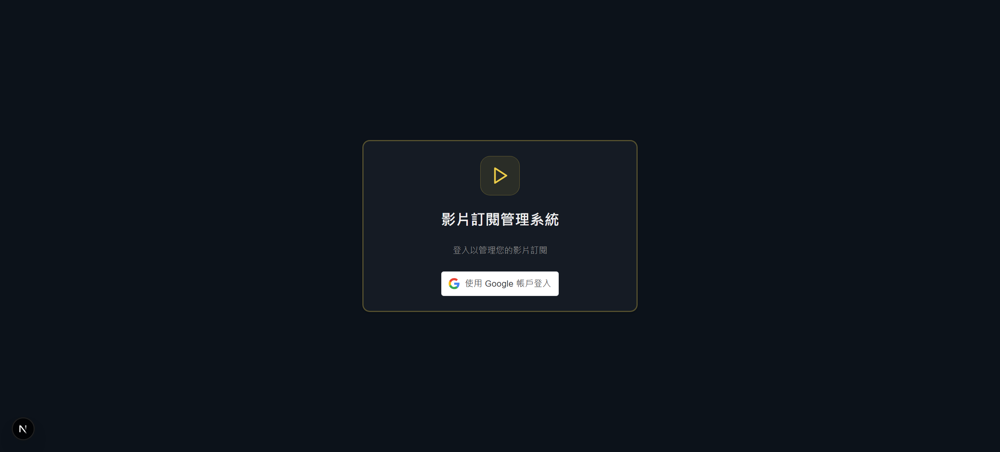
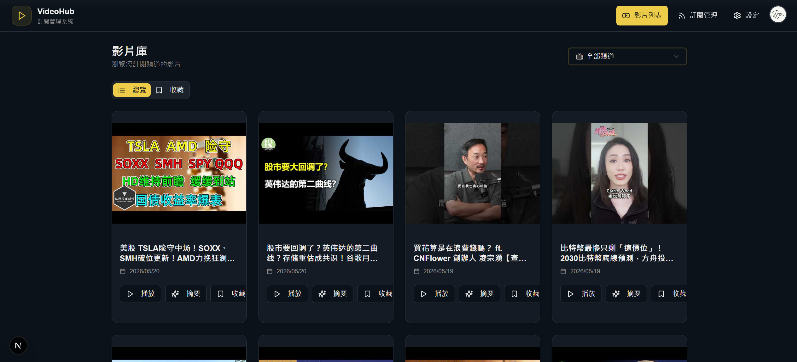
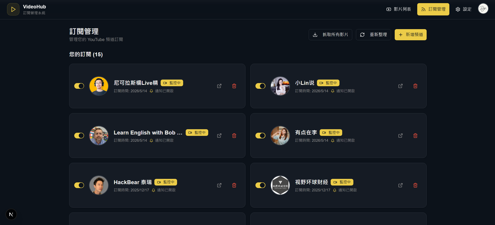
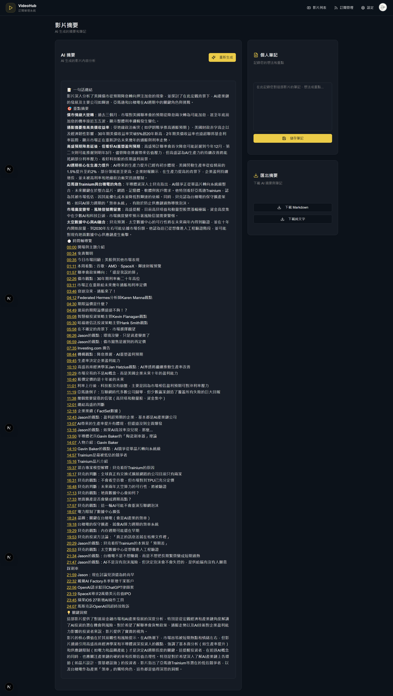
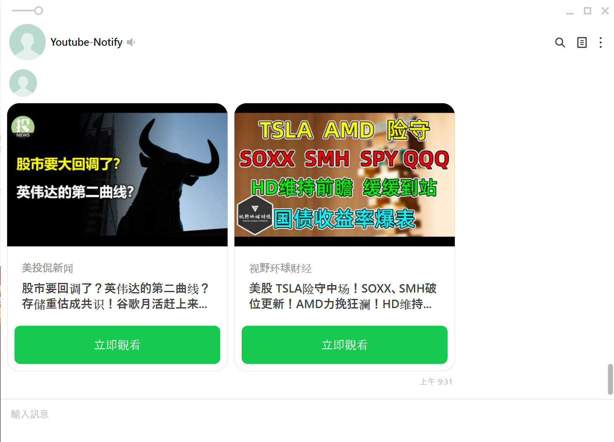
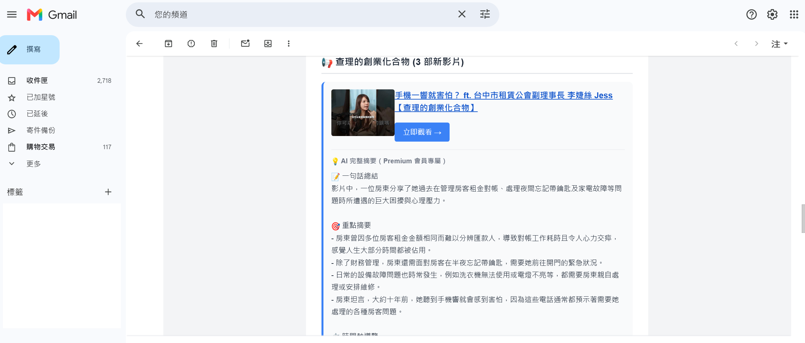

# VideoHub — 個人化 YouTube 訂閱與 AI 摘要系統

繞過 YouTube 演算法推薦,只追蹤白名單頻道更新,並以 Gemini 生成完整摘要
(含重點整理與可跳轉的時間軸導覽),透過 LINE 與 Email 推播給使用者。

**核心價值**:讓使用者用 3 分鐘讀完 AI 摘要,自主決定要不要看完整片。

---

## 為什麼做這個

YouTube 演算法傾向推薦「留住你的影片」而非「你想追蹤的內容」,重要頻道
的新片容易被淹沒。本系統以白名單機制取回訂閱主導權,並用 AI 摘要
壓縮觀影決策時間。

---

## 系統流程
訂閱頻道
↓
APScheduler 定期輪詢(預設每 15 分鐘)
↓
YouTube RSS Feed 偵測新影片
↓
url 送至 Gemini 生成摘要(總結 / 重點 / 時間軸 / 洞察)
↓
推播分流
├─ LINE Messaging API(即時卡片)
└─ Gmail SMTP(完整摘要,Premium 專屬)

> 日常偵測走 RSS 降低 API 配額,YouTube Data API 僅於新增頻道時使用。

---

## 功能截圖

### 1. Google OAuth 登入

### 2. 影片列表(白名單彙整,不受演算法干擾)

### 3. 訂閱管理(頻道白名單、獨立通知開關)

### 4. AI 摘要(含可點擊跳轉的時間軸)

Gemini 生成一句話總結、重點摘要、時間軸導覽、關鍵洞察。
可加個人筆記並匯出 Markdown / 純文字。

### 5. LINE 推播卡片

### 6. Gmail 完整摘要(Premium)

---

## Tech Stack

- **前端**: Next.js / React / TypeScript / Tailwind
- **後端**: Python / FastAPI / SQLAlchemy
- **資料庫**: MySQL
- **認證**: Google OAuth 2.0 + JWT
- **資料來源**: YouTube RSS Feed + YouTube Data API v3
- **字幕**: youtube-transcript-api / yt-dlp
- **AI**: Google Gemini API
- **推播**: LINE Messaging API / Gmail SMTP
- **排程**: APScheduler

---

## 開發模式

本專案以 Coding Agent 協作模式(Claude Code)開發:
需求拆解 → 架構決策 → Agent 產出 → 質疑與修正 → 整合測試。
架構、資料模型、推播分流邏輯由我決定,Agent 負責 code 翻譯,
最終品質由我 review 把關。

---

## 快速啟動

git clone https://github.com/Dyc77/video-subscription-system.git
cd video-subscription-system

### 前端

pnpm install
cp .env.local.example .env.local  # 填入 API URL 與 Google Client ID
pnpm run dev  # http://localhost:3000

### 後端

cd backend
python -m venv venv && source venv/bin/activate  # Windows: venv\Scripts\activate
pip install -r requirements.txt
cp .env.example .env  # 填入 DB、OAuth、Gemini、YouTube、SMTP、LINE 設定
py -m app.main

### 環境變數重點

- `GOOGLE_CLIENT_ID` / `GOOGLE_CLIENT_SECRET`(前後端同一組)
- `GOOGLE_API_KEY`(Gemini)
- `YOUTUBE_API_KEY`(新增頻道用)
- `SMTP_*`(Gmail 需使用「應用程式密碼」)
- `LINE_CHANNEL_SECRET` / `LINE_CHANNEL_ACCESS_TOKEN`
- `WATCHER_INTERVAL_MINUTES`(輪詢間隔,預設 15)
